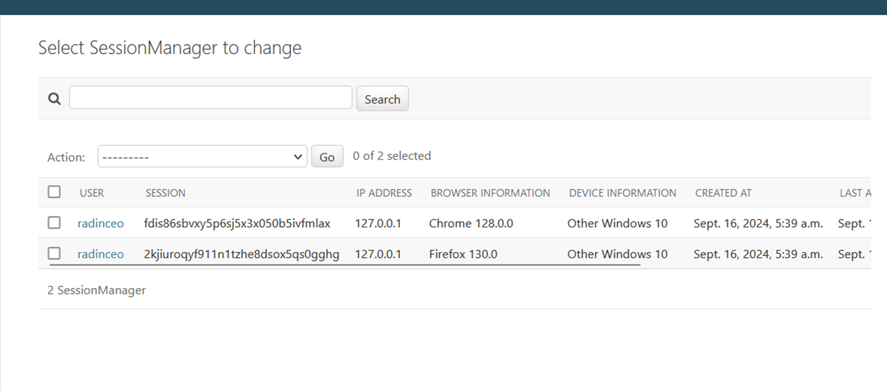
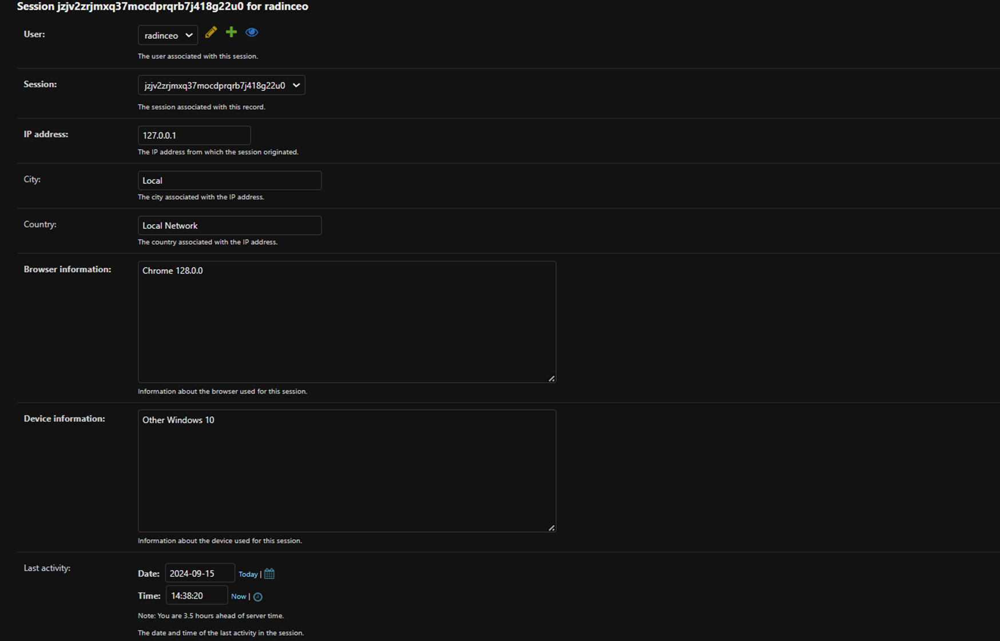
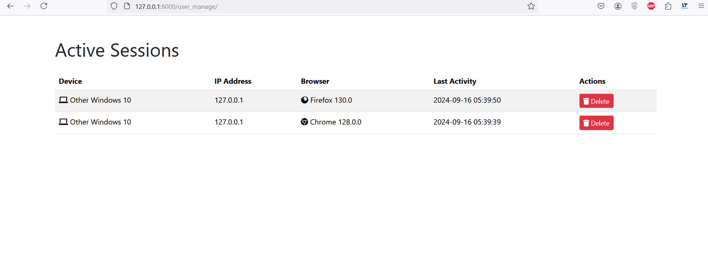

Admin Layer
===========

The admin layer customizes the Django admin interface to manage user sessions and allows you to view, track, and deactivate sessions directly from the interface.

Managing User Sessions
----------------------

In the Django admin interface, you can manage various sessions, including viewing details such as IP address, browser, and last activity. You can also deactivate or terminate sessions that are no longer required.

Viewing User Sessions
---------------------

To view the list of active user sessions:

1. Navigate to the Django admin interface.
2. Select `UserSession` from the list of models.

This will display a list of all active sessions, where you can view details like the IP address, device information, and last activity.

Adding and Editing User Sessions
--------------------------------

While the session records are automatically managed by the middleware, you can still manually update or delete session records if needed.

1. To add a session manually, click on the `Add Session` button in the top-right corner.
2. To edit an existing session, click on the session record in the list.

In the session details, you can see fields like IP address, browser information, device information, and session expiration time.

Click `SAVE` to apply any changes.

Deactivating User Sessions
--------------------------

View Layer
==========

The view layer provides an interface where users can manage their active sessions. The user can see which devices are currently logged into their account and deactivate any session if necessary.

Managing Sessions via Views
---------------------------

The `UserSessionsView` provides users with a list of their currently active sessions. The view displays detailed information such as the device, IP address, browser, and last activity.

Example:
^^^^^^^^

.. code-block:: python

    from sage_session.views.session import UserSessionsView

    class UserSessionsView(TemplateView):
        template_name = 'user_sessions.html'

        def get_context_data(self, **kwargs):
            context = super().get_context_data(**kwargs)
            # Add session data to the context
            context['sessions'] = UserSession.objects.filter(user=self.request.user)
            return context

Deactivating Devices
--------------------

Users can also deactivate devices that are logged into their account by clicking the `Deactivate` button next to the session they want to terminate. The session will be removed, and the user will be logged out on that device.

Example:
^^^^^^^^

.. code-block:: python

    from django.views.generic import DeleteView
    from django.urls import reverse_lazy
    from sage_session.models import UserSession

    class DeleteSessionView(DeleteView):
        model = UserSession
        success_url = reverse_lazy('usermanagement')

        def get_queryset(self):
            return self.model.objects.filter(user=self.request.user)

.. note::
    Users can see detailed information about their active sessions, such as the last activity timestamp, to monitor which devices are logged in.
